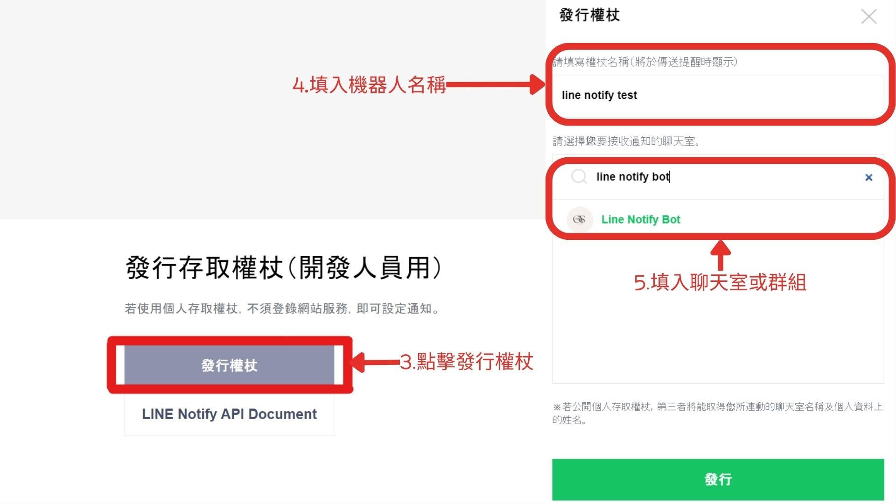
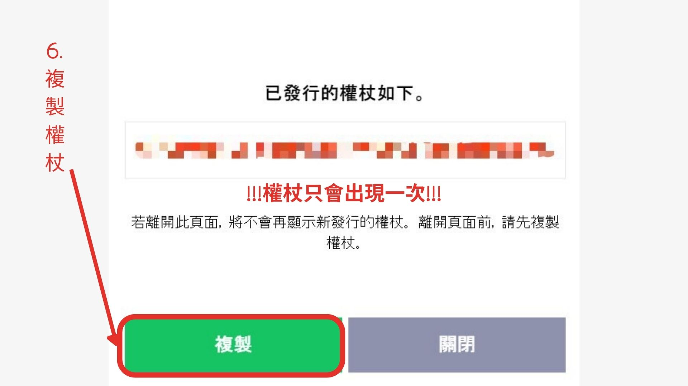
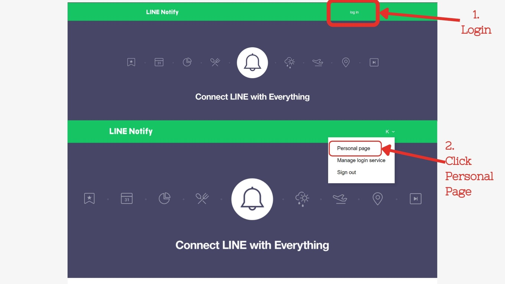
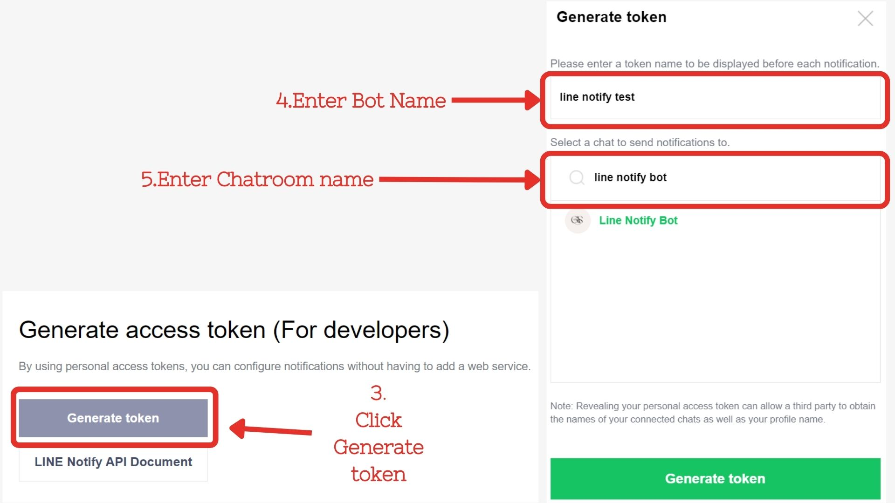
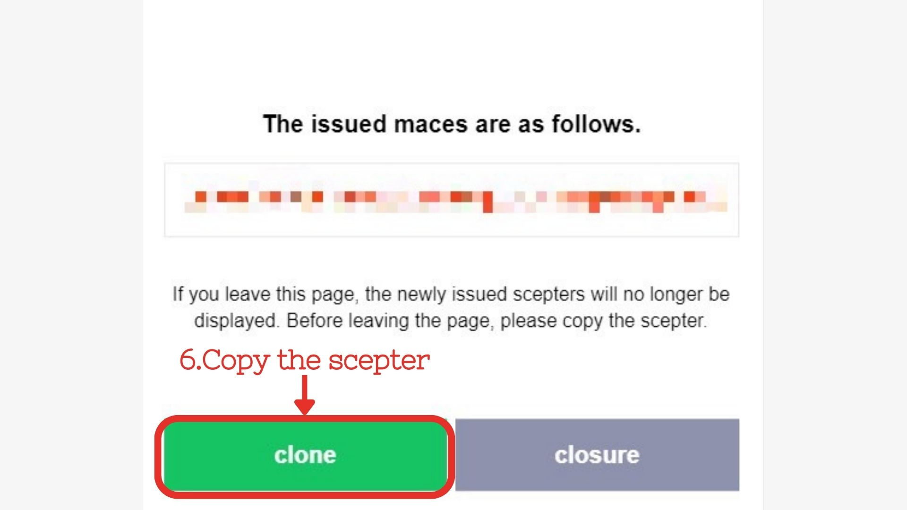

# API 例行功能檢查檢查機器人

📖[英文版README.md](#APIAutoCheckBot)📖

## 這個專案可以自動檢查 API 的狀態，並在出現錯誤時發送Line Notify通知。
## 如何使用
### 關於 Line Notify

1. #### 前往 https://notify-bot.line.me/en/ 並使用您的 Line 帳號登錄。

2. #### 點擊「個人頁面」 > 發行權杖。

   
   
3. #### 填入機器人名稱和聊天室名稱，並點擊生成權杖。

   
   
4. #### 複製權杖並**填入 config.yml** 檔案中。

   

### Requirements

- PyYAML~=6.0.1
- requests~=2.31.0

### 關於 config.yml
```
line_notify_token: ''


api_data:
      - api_name: 'api_1'
        environment_name: 'api_1.postman_environment'
        use: "True"

      - api_name: 'api_2'
        environment_name: 'api_2.postman_environment'
        use: "True"

      - api_name: 'api_3'
        environment_name: 'api_3.postman_environment'
        use: "True"
```
- line_notify_token: 您的 Line Notify Token
- api_data: 您要檢查的 API 資料
  - api_name: API 的名稱 
  - environment_name: Postman 環境的名稱 
  - use: 如果要檢查此 API，請設為 "True"，否則設為 "False"

**您可以在 config.yml 檔案中新增更多的 api_data。**

### 如何執行
1. Clone 此專案或是下載最新版本的release
2. 安裝 requirements (若下載release則跳過此步驟)
3. 在 config.yaml 檔案中輸入 Line Notify Token（如果沒有 Token：[關於Line Notify](#About-Line-Notify))
4. 在 config.yaml 檔案中輸入 API 資料（如果沒有 config.yml，請執行 **main.py** 創建一個） 
5. 執行 **main.py** 生成 **collection資料夾**和**environment資料夾**
6. 再次執行 **main.py** 以檢查 API 的狀態

## 貢獻

### 如何貢獻

1. Fork這個專案。 
2. 將您的Fork專案克隆到本地計算機。 
3. 建立一個新的分支。 
4. 貢獻您的代碼。 
5. 提交/推送您的代碼。 
6. 建立一個新的Pull Request。 
7. 等待回覆。

### Code Writing/Commit 規則

* 每行不超過100個字符。
* 變數和函數名稱使用snake_case。
* 在文件末尾添加一個空行。
* 優化代碼並刪除不必要的導入。
* 使用以下格式編寫提交消息並以英語撰寫：
  * Update - 在此處寫入您的提交消息
  * Fix bug - 在此處寫入您的提交消息
  * Optimize - 在此處寫入您的提交消息
  * Standardize - 在此處寫入您的提交消息

### 建議/問題報告

如果您有任何建議或發現任何問題，請在[Issues](https://github.com/KXX-Hub/API_Auto_Check_Bot/issues)提交您的反饋，我會盡快回覆！

# API Auto Check Bot

📖[中文版README.md](#API例行功能檢查檢查機器人)📖

## This Project can automatically check the status of API and send notify when comes to error.
## How to use
### About Line Notify

1. #### Go to https://notify-bot.line.me/en/ and login with your Line account.
2. #### Click on My Page > Generate Token.

   
   
3. #### Enter a name for the token and click on Generate Token.

   
   
4. #### Copy the token and **paste it in config.yaml**.

   

### Requirements

- PyYAML~=6.0.1
- requests~=2.31.0

### About config.yaml
```
line_notify_token: ''


api_data:
      - api_name: 'api_1'
        environment_name: 'api_1.postman_environment'
        use: "True"

      - api_name: 'api_2'
        environment_name: 'api_2.postman_environment'
        use: "True"

      - api_name: 'api_3'
        environment_name: 'api_3.postman_environment'
        use: "True"
```
- line_notify_token: Your Line Notify Token
- api_data: The data of API you want to check
  - api_name: The name of API
  - environment_name: The name of Postman environment
  - use: If you want to check this API, set it to "True", otherwise set it to "False"

  - **You can add more API data in config.yaml.**
### How to run
1. Clone this repo or download the latest release.
2. Install requirements (If you download the latest release, skip this step)
3. Enter the Line Notify Token in config.yaml(If you don't have token : [About Line Notify](#About-Line-Notify))
4. Enter the API data in config.yaml(If there's no config.yml . Run **main.py** to creat one)
5. Run **main.py** to get api collection folder and environment folder 
6. Run **main.py** again to check the status of API

## Contributing to the Project

### How to Contribute

1. Fork this project.
2. Clone your forked project to your local machine.
3. Create a new branch.
4. Contribute your code.
5. Commit/Push your code.
6. Create a new Pull Request.
7. Wait for a response.

### Code Writing/Commit Guidelines

* Keep each line under 100 characters.
* Use `snake_case` for variable and function names.
* Add a trailing blank line at the end of files.
* Optimize code and remove unnecessary imports.
* Use the following format for commit messages and write them in English:
  * Update - your commit messages here
  * Fix bug - your commit messages here
  * Optimize - your commit messages here
  * Standardize - your commit messages here

### Suggestions/Issue Reporting

If you have any suggestions or discover any issues, please submit your feedback in the [Issues](https://github.com/KXX-Hub/API_Auto_Check_Bot/issues)
section, and I will respond as soon as possible!
